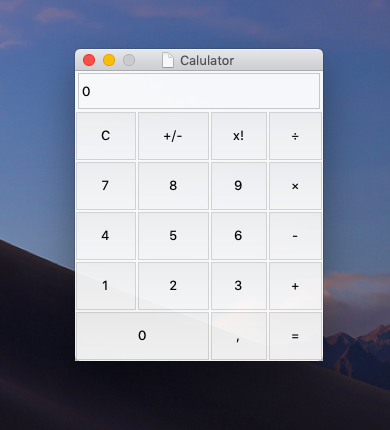

# Calculator
This is my simple calculator created in Python, it is my first experience with creating GUI. The GUI was implemented with standart Python interface Tkinter.

# Design
Calculator is implemented in standart minimalist macOS design, I've only made the window a little transparent
# Tech Stack
Python (Tk GUI)
